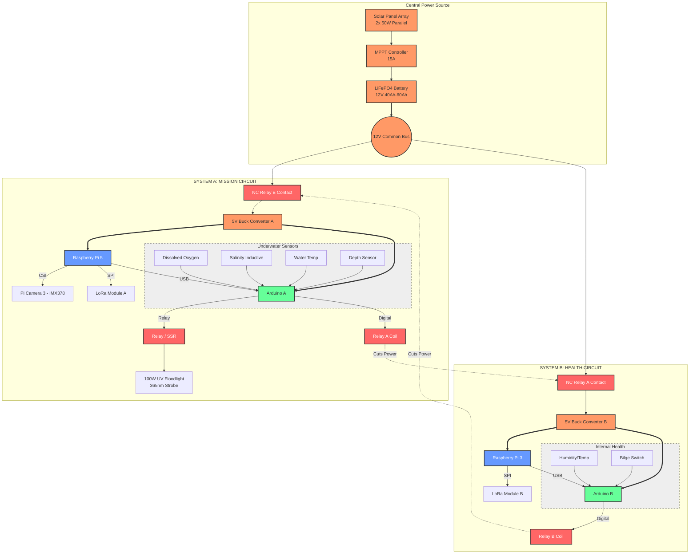

# OceanPulse Oil Detection Hardware Schematic

This schematic represents the **Phase 1: Port Sentry** hardware architecture, focusing on the **System A (Mission Circuit)** which handles autonomous oil spill detection using UV fluorescence and computer vision.

## System Architecture Diagram

## Component Roles in Oil Detection

| Component | Role | Details |
| :--- | :--- | :--- |
| **Raspberry Pi 5** | **Mission Intelligence** | Runs OpenCV/AI models for oil detection from camera feed. |
| **Pi Camera 3** | **Imaging Sensor** | High-resolution IMX378 sensor for capturing surface fluorescence. |
| **UV Floodlight** | **Excitation Source** | 100W 365nm LED array that causes oil to fluoresce at night. |
| **Arduino Mega (A)** | **Strobe Controller** | Triggers the UV relay for precise <1s pulses to conserve power. |
| **LiFePO4 Battery** | **Power Core** | Provides stable 12V supply for the high-power UV strobe and Pi 5. |

## Operational Logic for Detection
1. **Trigger:** System B or a timer wakes System A (Pi 5).
2. **Strobe:** Arduino A activates the UV Relay.
3. **Capture:** Pi Camera 3 takes a long-exposure frame during the UV pulse.
4. **Process:** Pi 5 analyzes the frame for specific spectral signatures of petroleum fluorescence.
5. **Alert:** If oil is detected, an alert is sent via **LoRa Module A**.
